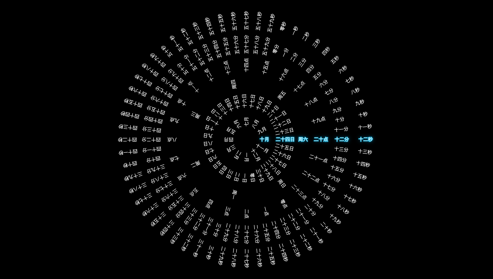

<div align="center">
  

  # ⏰ TimeCircles - 时间轮盘可视化

  *一个优雅的同心圆盘时间可视化工具，实时展示当前时间*

  [](https://opensource.org/licenses/MIT)
  [](https://reactjs.org/)
  [](https://vitejs.dev/)

  **[🌐 在线演示](https://time.geekaso.com)** • **[📖 功能规划](./ROADMAP.md)** • **[🎯 优化方向](./优化方向总结.md)**
</div>

> 一个优雅的同心圆盘时间可视化工具。在旋转的轮盘上清晰直观地展示当前时间。

## 💡 项目来源

这个项目的灵感来自于互联网上看到的一个类似的时间轮盘设计。当时对这个创意印象深刻，但后来无法找到原始项目，所以从零开始重新设计和实现了这个版本。

**本项目是一次创意重现和技术探索**，通过 React + Canvas 的组合实现了一个功能完整、交互流畅、视觉优雅的时间可视化工具。感谢那个未知项目给予的灵感！

---

## ✨ 特性

- 🎡 **6层同心圆盘** - 月、日、星期、小时、分钟、秒实时显示
- ⚡ **高效渲染** - 基于HTML5 Canvas，60fps流畅动画
- 💫 **智能高亮** - 当前时间自动发光，青蓝色科技感
- 🎯 **参考线设计** - 中心向右的参考线始终指示当前时间
- 🔄 **平滑动画** - 200ms立方缓动，自然逼真的转动效果
- 📱 **高分屏支持** - 自适应devicePixelRatio，文字清晰锐利
- 🌙 **深色主题** - 黑色背景，优雅简洁

## 🎬 效果展示

### 在线演示
🌐 **[点击查看在线演示](https://time.geekaso.com)** ⏰

### 截图预览



*优雅的深色界面，6层同心圆盘展示不同粒度的时间，当前时间用青蓝色高亮显示*

---

## 🚀 快速开始

### 前置要求
- Node.js >= 14
- npm 或 yarn

### 安装与运行

```bash
# 克隆项目
git clone https://github.com/yourusername/TimeCircles.git
cd TimeCircles

# 安装依赖
npm install

# 启动开发服务器（热更新）
npm run dev
# 访问 http://localhost:5173

# 构建生产版本
npm run build

# 预览生产构建
npm run preview
```

## 📖 工作原理

### 显示逻辑

参考线（中心向右的横线）所在位置始终显示当前时间。轮盘逆时针旋转，使得当前时间值始终对齐到参考线位置。

示例（2025-10-25 11:50:00）：
```
十月 十八日 周五 十点 四十九分 五十九秒  ← 上一秒
十月 十八日 周五 十一点 五十分 零秒      ← 当前时间（高亮）
十月 十八日 周五 十一点 五十分 一秒      ← 下一秒
```

### 旋转角度计算

每一层圆圈旋转的角度公式：

```
旋转角度 = -(当前索引 / 总项数) × 360°
```

例如：
- **秒圈** (60项)：第30秒时 = -(30/60)×360° = -180°
- **分圈** (60项)：第30分时 = -(30/60)×360° = -180°
- **小时圈** (24项)：第12时时 = -(12/24)×360° = -180°
- **日圈** (31项)：第16日时 = -((16-1)/31)×360° ≈ -174.2°
- **星期圈** (7项)：周三时 = -(3/7)×360° ≈ -154.3°
- **月圈** (12项)：10月时 = -(10/12)×360° = -300°

### 动画机制

- **动画时长**：200ms（每次时间单位变化时触发）
- **缓动函数**：easeInOutCubic（立方缓动）
- **效果**：平滑而自然的"咔一下"旋转感

## 📁 项目结构

```
TimeCircles/
├── src/
│   ├── components/
│   │   └── TimeWheel/
│   │       ├── TimeWheel.jsx          # 主组件（动画和渲染逻辑）
│   │       └── TimeWheel.css          # 样式
│   ├── hooks/
│   │   ├── useAnimation.js            # requestAnimationFrame 循环
│   │   └── useTime.js                 # 实时时间获取
│   ├── utils/
│   │   ├── CanvasRenderer.js          # Canvas绘制引擎
│   │   ├── TimeCalculator.js          # 角度计算工具
│   │   └── constants.js               # 配置常量
│   ├── App.jsx                        # 应用入口
│   ├── main.jsx                       # React启动点
│   └── index.css                      # 全局样式
├── index.html
├── package.json
├── vite.config.js
└── README.md
```

## 🎨 圆圈配置

| 圆圈 | 半径(px) | 项数 | 数据 |
|-----|---------|------|------|
| 月圈 | 60 | 12 | 一月～十二月 |
| 日圈 | 130 | 31 | 一日～三十一日 |
| 星期圈 | 190 | 7 | 周日～周六 |
| 小时圈 | 250 | 24 | 零点～二十三点 |
| 分钟圈 | 320 | 60 | 零分～五十九分 |
| 秒圈 | 400 | 60 | 零秒～五十九秒 |

## 🔧 核心模块

### TimeWheel.jsx
主要职责：
- 通过 `useAnimation` Hook 获取动画帧时间戳
- 通过 `useTime` Hook 获取当前系统时间
- 检测时间变化，触发平滑动画
- 调用 CanvasRenderer 进行绘制

### TimeCalculator.js
工具类，提供：
- `calculateRotations()` - 根据时间计算各层旋转角度
- `normalizeAngle()` - 角度正规化（0-360）
- `degreesToRadians()` / `radiansToDegrees()` - 单位转换

### CanvasRenderer.js
Canvas绘制引擎：
- `drawTimeWheel()` - 主绘制函数
- `drawLayer()` - 绘制单层圆圈和文字
- `drawText()` - 绘制文字（支持旋转和高亮）

### constants.js
集中配置：
- 圆圈半径 (RADII)
- 数据个数 (COUNTS)
- 文字样式 (TEXT_CONFIG)
- 格式化函数 (formatMonth, formatDay 等)

## 🎯 高亮效果

当前时间的数字会显示为：
- 青蓝色 (#00a8d8) 的轮廓描边
- 多层发光背景（深青蓝色 #006699 + 柔和青蓝色）
- 白色清晰的核心文字
- 创造出"圆形光源从背后照亮"的立体感

## 📱 高分屏支持

通过 `window.devicePixelRatio` 自动检测屏幕像素比，动态调整 Canvas 物理分辨率，确保文字在各种屏幕上都清晰锐利。

## 📊 性能指标

- 首屏加载：< 500ms
- 稳定帧率：60 FPS
- 内存占用：< 50MB
- Canvas 重绘：每帧（取决于时间变化）

## 🛠️ 技术栈

| 技术 | 版本 | 用途 |
|-----|------|------|
| React | 18+ | UI 框架 |
| Vite | 5.4+ | 构建和开发服务器 |
| HTML5 Canvas | - | 2D 图形渲染 |
| JavaScript | ES6+ | 核心逻辑 |
| CSS3 | - | 样式 |

## 🚀 后续优化方向

本项目拥有**完整的功能规划和优化策略**，包括 23 个可能的功能扩展方向，涵盖功能、交互、视觉、性能和集成等多个维度。

详细的规划文档和建议实施路线，请参考：

- 📖 **[ROADMAP.md](./ROADMAP.md)** - 详细的功能规划（包含实现方案、难度评估、时间成本）
- 🎯 **[优化方向总结.md](./优化方向总结.md)** - 快速参考（优先级分类、建议路线、ROI分析）

### 快速了解核心方向

| 优先级 | 功能示例 | 难度 | 价值 |
|--------|--------|------|------|
| 🔴 P0 | 多主题、中心数字、显示/隐藏层、全屏 | ⭐ | ⭐⭐⭐⭐ |
| 🟠 P1 | 多时区、倒计时、点击交互、农历显示 | ⭐⭐ | ⭐⭐⭐⭐ |
| 🟡 P2 | 高级高亮、背景动画、性能优化、TypeScript | ⭐⭐⭐ | ⭐⭐⭐ |
| 🔵 P3 | 天气集成、日历集成、会议室版本、学习追踪 | ⭐⭐⭐⭐ | ⭐⭐⭐⭐ |

## 📄 许可证

MIT License - 详见 [LICENSE](LICENSE) 文件

## 🙏 致谢

感谢所有为这个项目提供反馈和建议的人！

## 📧 联系方式

如有问题或建议，欢迎：
- 提交 Issue
- 发起 Pull Request
- 发邮件交流

---

**Made with ❤️ using React + Canvas**
